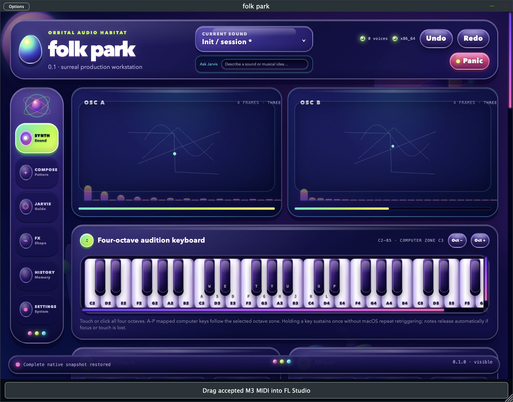
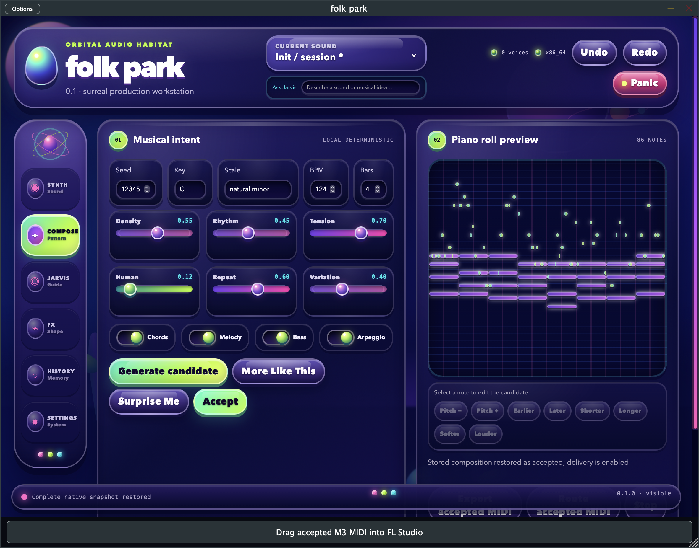
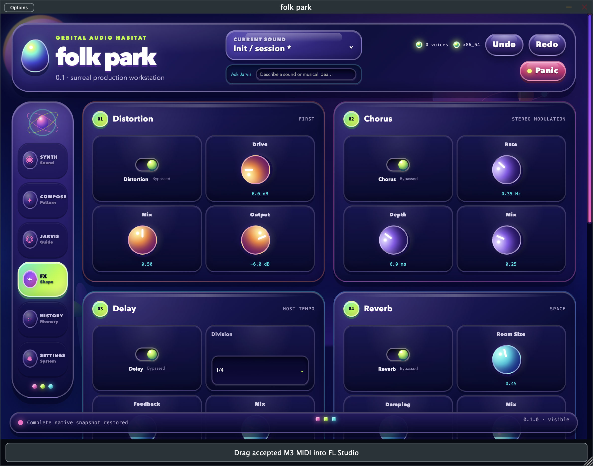
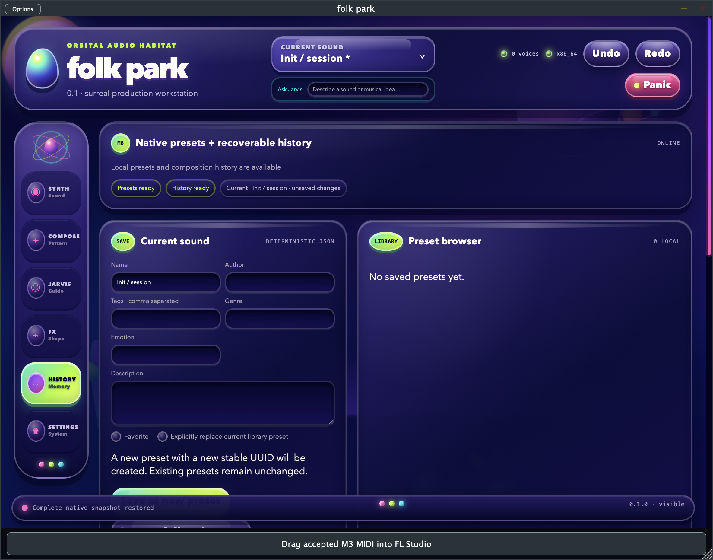
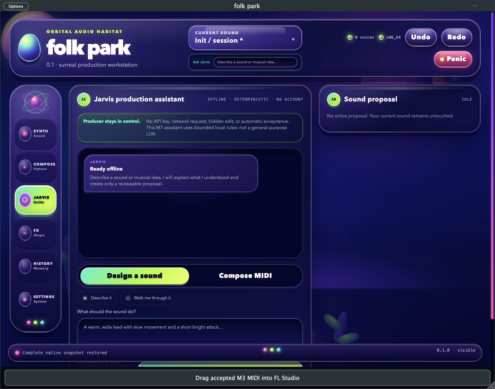
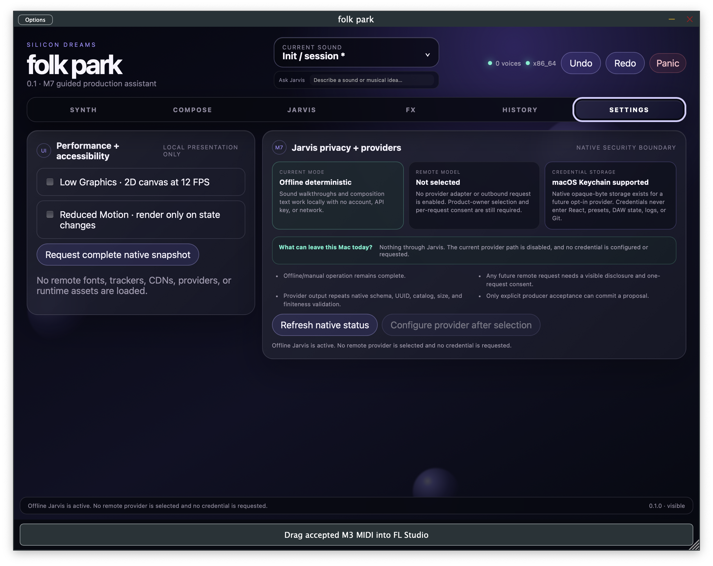
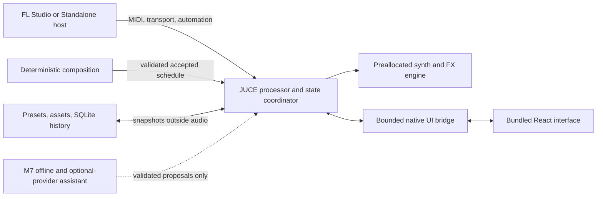

# folk park

<p>  </p>

**An original wavetable synthesizer and deterministic composition assistant for Intel macOS.**

> **Implementation branches:** The verified M8 engineering candidate is reviewed on [`feat/m8-release-hardening`](https://github.com/HermannPR/folk-park/tree/feat/m8-release-hardening). Active synthesized-drum development is reviewed on [`feat/rhythm-lab-r1`](https://github.com/HermannPR/folk-park/tree/feat/rhythm-lab-r1). The default branch keeps this recruiter-facing overview while private stacked PRs and required FL Studio/owner gates remain open.

`folk park` combines a playable dual-wavetable instrument, MIDI idea generation, an ordered effects chain, offline audio rendering, and crash-aware local persistence in one Standalone/VST3 product. Release 0.1 targets FL Studio on Intel (`x86_64`) macOS.

> **Current status — M8 automated checkpoint verified.** The private Intel Standalone/VST3 candidate passes 19/19 UI contracts, 16/16 Release suites, a 120-second deterministic recovery run, pluginval 1.0.4 at strictness 5, and an independent render through the exact installed VST3. FL Studio checks, listening, signing/notarization, JUCE distribution licensing, final identity, and public-distribution decisions remain explicitly unresolved; this is not yet a public binary release.

> **Latest repair.** The Compose macros no longer retain React event objects inside deferred state updates, fixing the reported black interface when moving Repeat and the other musical controls. The focused UI gate passes 18/18, the rebuilt Release suite passes 16/16, pluginval strictness 5 ends `SUCCESS`, and the exact repaired VST3 is installed with verified hash parity plus an independent finite-audio MIDI render. Real Standalone control interaction and FL Studio confirmation remain producer-required.

> **Latest visual checkpoint.** The complete interface now uses the original **Orbital Habitat** design system: reusable retro-CGI materials, physical controls, saturated instrument colors, coherent navigation, motion/reduced-motion tokens, and an authored surreal workstation environment. The final Release build passes 19/19 UI contracts, 16/16 native suites, pluginval strictness 5, installed-bundle hash parity, and an independent MIDI render. The screenshots below are captures of the real Release Standalone, not concept art.

## Reviewer quick start

This repository is designed to be evaluated as a working audio product rather than a static interface exercise:

1. Start with the real Release screenshots in the product tour below.
2. Read [Architecture](https://github.com/HermannPR/folk-park/blob/feat/rhythm-lab-r1/docs/ARCHITECTURE.md) and [Real-time safety](https://github.com/HermannPR/folk-park/blob/feat/rhythm-lab-r1/docs/REALTIME_SAFETY.md) for the native ownership and callback model.
3. Review [M8 verification](https://github.com/HermannPR/folk-park/blob/feat/rhythm-lab-r1/evidence/m8/verification.md) for exact commands/results, artifact hashes, environment, retained validator output, and limitations.
4. Inspect `src/plugin`, `src/synth`, `src/midi`, `src/persistence`, `src/assistant`, and `ui/src` using the repository guide below.
5. Build with the pinned commands in [Build and run](#build-and-run). No API account or key is required for the complete offline/manual workflow.

The strongest engineering themes are real-time safety, transactional state, deterministic generation, strict native/WebView contracts, failure isolation, evidence-based release claims, and producer-controlled AI assistance.

## Product tour

### Design and audition

Both oscillators display the real bounded wavetable data, current frame position, and derived spectrum. A four-octave C2–B5 keyboard supports touch/mouse play plus an octave-shiftable computer-key zone. Held macOS keys sustain once instead of retriggering from keyboard repeat.



### Compose musical ideas

The deterministic composition engine creates chords, melody, bass, and arpeggios from seed, key, scale, tempo, length, and musical macro controls. A candidate can be inspected and edited in the piano roll; export, drag, routing, and WAV rendering use only an explicitly accepted result.



### Shape and render

The fixed serial chain is Distortion → Chorus → tempo-synced Delay → Reverb → Compressor → Parametric EQ. Every stage has an independent gain-safe bypass, stable host parameters, bounded DSP, and a 10 ms transition. Accepted compositions can be rendered to stereo 24-bit/48 kHz WAV in an isolated offline engine without seeking or resetting live voices.



### Save, search, and recover

Versioned `.folkparkpreset` files store the complete sound, modulation, effects, metadata, and content-addressed user wavetable references. Searchable SQLite composition history keeps stable IDs, lineage, favorites, tags, recoverable deletion, comparison, and recall. Missing assets produce an explicit exact-hash relink flow instead of a partial project mutation.



### Ask Jarvis without surrendering control

The M7 workspace accepts a typed sound goal or musical idea. For sound design, producers can describe the result directly or use a walkthrough that asks no more than two focused questions at a time. Jarvis then shows its interpretation, assumptions, confidence, and every proposed current→new parameter value. Original A remains audible until the producer chooses proposal B; acceptance or rejection is always explicit. For composition, text creates only a candidate that must still be reviewed in the existing piano roll before delivery.



The current engine is intentionally honest: it is a deterministic offline production helper, not a general-purpose LLM. It requires no account, key, or network. A native settings panel reports that nothing leaves the Mac and no credential is configured. The typed provider and macOS Keychain boundaries exist for later opt-in integration, but no remote adapter has been selected or enabled; that still requires a product-owner choice, a provider-specific privacy disclosure, and per-request consent.



## Why this project is technically interesting

This is not only a UI prototype. The repository contains the instrument DSP, host integration, persistence formats, deterministic music engine, production interface, validation suites, and retained release evidence.

- **Real-time ownership is explicit.** The audio callback does not parse JSON, touch files or SQLite, wait on locks, call the UI/network, or allocate. Wavetables, modulation routes, composition schedules, and other complex state cross into audio only through bounded queues or complete validated snapshots.
- **State changes are transactional.** Invalid presets, malformed project payloads, missing/wrong assets, failed database work, and busy publication slots leave the last valid live sound unchanged.
- **The UI is disposable presentation.** React/TypeScript consumes a strict complete C++ snapshot. Closing or reloading the WebView does not own or interrupt audio state.
- **Composition is deterministic and testable.** One normalized intent and seed produce bounded host-independent events. Candidate and accepted bundles are separate so generation or editing cannot silently replace deliverable material.
- **Offline rendering is isolated.** WAV preview uses separate synth/effect instances built from immutable snapshots, then validates the temporary output before replacing a user-approved destination.
- **Credentials stay behind a native boundary.** The future-provider store accepts only bounded opaque bytes under exact identifiers, uses macOS Keychain with a device-only accessibility class, and never exposes credential values to React, presets, DAW state, logs, or Git.
- **Diagnostics are inspectable before disclosure.** A producer can preview a deterministic sub-4-KiB technical report before copying it. It contains fixed build/host/audio/status fields and counters—not paths, project or preset names, prompts, audio, database content, or credentials.
- **Evidence is retained.** Each milestone records tests, validator logs, artifact hashes, visual checks, known limitations, and the exact boundary between automation and human host verification.

## Orbital Habitat visual system

The interface is an original code-native translation of early pre-rendered CGI, experimental 1990s workstation graphics, tactile toys, and psychedelic electronic culture. It does not reproduce another product's interface or assets. CSS geometry creates the egg, orbital dock, distant forms, horizon grid, plastic slabs, rim light, ambient occlusion, and glossy controls; no external image, font, or runtime URL is required.

Reusable design tokens cover the ultraviolet/lime/magenta/turquoise palette, material gradients, surface depth, specular highlights, shadows, glows, radii, spacing, typography, and spring-like timing. Shared React primitives include Button, IconButton, Panel, Sidebar, Navbar, Tabs, Slider, Knob, Toggle, Dropdown, Modal, Tooltip, TextInput, NumericInput, TextArea, ProgressBar, Meter, ContextMenu, Notification, and StatusIndicator. Host-aware versions preserve JUCE parameter gestures and automation ownership.

The visual hierarchy stays functional: dark translucent work surfaces carry readable content; glossy physical controls sit above them; bright color is reserved for active state and focus; status gems sit at the top and bottom edges. Low-graphics and reduced-motion preferences remove decorative movement while keeping the same layout and control semantics.

## Architecture



The processor is the host adapter and authority for state. The synth owns fixed-capacity voice/DSP memory. Composition, file conversion, persistence, rendering, and assistant work happen away from the callback. The assistant boundary is deliberately limited to validated intent and parameter proposals; it cannot execute arbitrary code or silently write into a DAW.

More detail is available in [Architecture](https://github.com/HermannPR/folk-park/blob/feat/rhythm-lab-r1/docs/ARCHITECTURE.md), [Real-time safety](https://github.com/HermannPR/folk-park/blob/feat/rhythm-lab-r1/docs/REALTIME_SAFETY.md), and the accepted [architecture decisions](https://github.com/HermannPR/folk-park/tree/feat/rhythm-lab-r1/docs/adr/).

## Implemented product surface

### Synth engine

- 16 deterministic polyphonic voices with released/quietest-then-oldest stealing and panic/no-stuck-note handling.
- Two independent project-generated wavetable oscillators: up to 16 × 2,048-sample frames, 11 FFT-built band-limited mip levels, frame morphing, phase/random/reset behavior, coarse/fine tune, level, and pan.
- Up to eight unison lanes per oscillator with detune, spread, blend, fixed fades, and smoothed live changes.
- Sine/triangle sub oscillator, deterministic white/pink noise, three envelopes, and four free/synced/retriggerable LFOs.
- Stable low/high/band-pass filter with resonance, drive, key tracking, and envelope depth.
- Ten modulation sources, thirteen destinations, three curves, and up to 32 transactionally published routes.
- Strict user-WAV decoding/conversion, preview and explicit confirmation, SHA-256 identity, content-addressed retention, atomic publication, and click-safe table crossfade.

### Composition and delivery

- Typed/versioned `MusicIntent` and `GeneratedClip` contracts with seed/version metadata, musical context, part selection, macro controls, ranges, polyphony, event limits, and parent lineage.
- Functional chord movement with triads/sevenths, inversions, bounded voice leading, and cadence handling.
- Chord-aware melody with contours, motifs, rests, passing tones, humanization, and leap limits; bounded bass and five arpeggio orders.
- `More Like This` keeps context and lineage while producing a controlled difference; `Surprise Me` creates a separate bounded candidate.
- Candidate note editing for pitch, timing, duration, and velocity, followed by a fresh explicit acceptance boundary.
- One accepted bundle feeds multitrack Standard MIDI export, verified temporary drag files, direct MIDI routing with tracked note-offs, internal playback, and offline WAV preview.

### Effects and rendering

- Six independently bypassable effects in one documented order, exposed as stable host automation/state parameters.
- Tempo-aware delay, deterministic reset, non-finite containment, bounded feedback/output, and safe sample-rate/block-size transitions.
- Transactional stereo 24-bit/48 kHz WAV output with cancellation cleanup, reopen validation, and a documented maximum render bound.
- Live/offline isolation proof: preview rendering cannot mutate active live voices or their DSP state.

### Presets, projects, and history

- Deterministic schema-v2 `.folkparkpreset` documents with a pure v1→v2 migration and strict duplicate/size/path validation.
- All 102 normalized host parameters, modulation routes, effects, metadata, and up to two imported wavetable assets captured by a native preset.
- Explicit Save As semantics: a normal save creates a new stable UUID; replacement is a separate intentional action.
- Bounded versioned host project state restores the complete native sound, imported asset references, accepted composition, dirty state, and history lineage without an editor.
- Searchable transactional SQLite history with recoverable soft deletion and database-failure isolation.
- Traversal/symlink rejection, SHA-256 and size checks, exact missing-asset recovery, and no partial mutation on failure.

## Real-time and reliability guarantees

The callback contract forbids allocation/deallocation, filesystem/database/network/WebView access, JSON/XML parsing, formatted logging, waits, and new locks. The automated real-time suite instruments global allocation and currently measures zero callback allocations while exercising synth publication, direct MIDI, preview keyboard work, and all six enabled effects.

Reliability tests cover malformed and oversized project state, future/duplicate/non-finite UI snapshots, wrong asset hashes, exact relink, busy publication exchanges, SQLite failure/symlink isolation, preset collision behavior, migration, history rollback/restart, deterministic MIDI properties, and external-host VST3 rendering.

## Technology

| Area | Implementation |
| --- | --- |
| Audio/host | C++20, JUCE 8.0.13 pinned by commit, VST3 + Standalone |
| DSP | Fixed-capacity custom wavetable, modulation, voice, filter, effects, and render engines |
| UI | React 19, TypeScript, Vite, Three.js, custom Orbital Habitat component/tokens system, bundled through JUCE WebView resources |
| Persistence | Versioned JSON schemas, atomic native files, SHA-256 asset store, system SQLite |
| Assistant | Deterministic offline parser/walkthrough, typed catalog proposals, asynchronous provider boundary, native macOS Keychain store |
| Build | CMake presets, Ninja, Apple clang, Intel `x86_64` only for 0.1 |
| Quality | CTest/native property and integration suites, Node interface tests, pluginval, binary/signature/hash inspection |

## Verified M6 checkpoint

Verified on 2026-08-23 in America/Monterrey:

| Gate | Result |
| --- | --- |
| Clean UI install/audit | PASS — 0 npm vulnerabilities |
| UI contracts and strict TypeScript | PASS — 10/10 |
| Debug native/integration suites | PASS — 10/10 |
| Release native/integration + packaged VST3 smoke | PASS — 11/11 |
| pluginval 1.0.4 strictness 5 | SUCCESS |
| Audio matrix | 44.1/48/96 kHz × 64/128/256/512/1024 samples |
| Release artifacts | Thin Mach-O `x86_64` Standalone and VST3 |
| Local VST3 signature | Ad-hoc signature verifies deeply and strictly |
| Installed VST3 parity | Installed/build binary hashes match; independent MIDI render passes |
| Release/installed VST3 SHA-256 | `9b0fb548a4844b4384742e02248682fde8ffa479a19b9066c953dabc8c6572dc` |
| Release Standalone SHA-256 | `3e4cf0d884ad8a770100e7cc34ac6281959879acaf1495c9d03fefd79b1f810f` |

The complete evidence report and validator log are retained under [evidence/m6](https://github.com/HermannPR/folk-park/tree/feat/rhythm-lab-r1/evidence/m6/). Automated success is not an FL Studio pass: discovery, insertion, listening, physical input/focus behavior, automation, drag/routing, project reopen, preset/asset recovery, effects, and WAV import remain [HUMAN RUN REQUIRED](https://github.com/HermannPR/folk-park/blob/feat/rhythm-lab-r1/docs/FL_STUDIO_TEST_MATRIX.md).

## Verified M7 checkpoint

The current branch adds a connected Jarvis production workflow without requiring a network connection, provider account, or API key:

- Bounded typed composition/sound requests and responses with UUID, origin, target, consent, and stale-response validation.
- Deterministic offline parsing for key, scale, bars, tempo, requested parts, genre, emotion, and musical density/variation language.
- A stable guided walkthrough that asks no more than two focused sound questions at a time.
- Explained sound proposals using only the 102 real host parameter IDs and the exact captured current value for each proposed A/B change.
- Explicit acceptance preserved in every proposal; manual mode never invokes the assistant.
- A controllable mock provider with cancellation and at-most-once completion for failure-path testing.
- Processor-owned A/B audition that canonicalizes proposals to each host parameter's legal step, keeps temporary preview out of preset dirty tracking, restores A on rejection, and marks B dirty only after explicit acceptance.
- Version-2 host project state that reopens an active A/B comparison on the audible side while preserving backward compatibility with version 1.
- Seven bounded native operations for state, questions, proposal generation, A/B switching, explicit decisions, and candidate-only composition generation.
- A producer-facing message form with sound/composition modes, direct description or guided questions, deterministic seed, full proposal review, A/B controls, and a route into the existing piano roll.
- Strict frontend parsers that reject unsupported statuses, malformed UUID relationships, duplicate/non-finite/oversized changes, implicit acceptance, and invalid composition candidates.
- A native macOS Keychain abstraction for bounded opaque credential bytes, strict service/provider identifiers, device-only accessibility, exact update/read/removal, and best-effort in-memory zeroing.
- A provider/privacy settings surface that accurately reports offline mode, disabled remote integration, Keychain availability, and the rule that no credential crosses into frontend JavaScript.

The final M7 gate was verified on 2026-08-23 in America/Monterrey:

| Gate | Result |
| --- | --- |
| Clean UI install/audit | PASS — 0 npm vulnerabilities |
| UI contracts and strict TypeScript | PASS — 15/15 |
| Debug native/integration suites | PASS — 12/12 |
| Release native/integration + packaged VST3 smoke | PASS — 13/13 |
| pluginval 1.0.4 strictness 5 | SUCCESS |
| Audio matrix | 44.1/48/96 kHz × 64/128/256/512/1024 samples |
| Release artifacts | Thin Mach-O `x86_64` Standalone and VST3 |
| Native Keychain round trip | PASS — bounded store/read/update/remove with exact cleanup |
| Installed VST3 parity | Installed/build hashes match; independent MIDI render passes |
| Release/installed VST3 SHA-256 | `b17c88bab2c1356c7b01980b96f918a28acbdd337f7ee2e437f9c63a7d7119ca` |
| Release Standalone SHA-256 | `4523ffa815cfcdd7fb4d666644f75dde82869f6ebf673f9707f31314c8d3b1da` |

Actual Release interaction verifies native privacy status, explained proposal creation, original/proposal switching, rejection restoring A, and the guided two-question flow advancing to its next pair. The screenshots in this section are real M7 Release captures. Complete logs, hashes, observations, and additional captures are retained under [evidence/m7](https://github.com/HermannPR/folk-park/tree/feat/rhythm-lab-r1/evidence/m7/). Automated success is not an FL Studio or audible-quality pass.

## Verified M8 automated checkpoint

M8 has established a native privacy-safe diagnostics surface and stronger fault containment without changing the sound/preset contracts. Audio configuration is atomically observable; final non-finite samples are replaced with silence; overflow and malformed-state events increment bounded counters. The Settings UI requires a complete preview before it can copy the exact report associated with that preview ID. Previewing performs no filesystem, preference, project, database, provider, network, or clipboard write.

The final automated gate was verified on 2026-08-24 in America/Monterrey:

| Gate | Result |
| --- | --- |
| Clean UI install/audit | PASS — 34 packages, 0 vulnerabilities |
| UI contracts and strict TypeScript | PASS — 17/17 |
| Debug native/integration suites | PASS — 15/15 |
| Release native/integration + packaged VST3 smoke | PASS — 16/16 |
| Extended Release recovery run | PASS — 120 simulated seconds, 11,250 blocks, finite output |
| pluginval 1.0.4 strictness 5 | SUCCESS |
| Release artifacts | Thin Mach-O `x86_64` Standalone and VST3 |
| Installed VST3 parity | Exact hashes match; signature/architecture verify; independent MIDI render passes |
| Release/installed VST3 SHA-256 | `9295e582e705837020f72f657105d5efd2213d5e8904dee628d7e55e52a82a84` |
| Release Standalone SHA-256 | `bb61054c5acf8f9fb3711acd49220dc6ddcf6508d4ea4bc5513d6e82c1778386` |
| Release material/security/schema scans | PASS — seven schemas; private repository confirmed |

The Release runtime probe exercised repeated notes, 2×2 unison, all six effects, panic/release, preview-overflow recovery, direct-MIDI Stop, and three editor reconstructions while checking every output sample for finiteness. It measured `0.153058×` realtime on the documented Intel i9 machine. That is reproducible one-machine evidence, not an owner-approved CPU budget or an audible-quality claim. The complete report and validator log are retained under [evidence/m8](https://github.com/HermannPR/folk-park/tree/feat/rhythm-lab-r1/evidence/m8/).

## Validation

- **pluginval** at strictness 5 ends `SUCCESS` for the VST3.
- 19/19 UI contract checks and 16/16 native Release suites pass.
- Independent finite-audio MIDI render through the installed VST3, with installed-bundle hash parity.

## Build and run

### Requirements

- Intel Mac (`x86_64`) running macOS 12 or later.
- Xcode Command Line Tools / Apple clang.
- Git, CMake 3.25+, Ninja, Node.js, and npm.
- The pinned JUCE submodule and system SQLite development library available to CMake.

Clone with submodules, then verify the local toolchain:

```bash
git clone --recurse-submodules <private-repository-url>
cd folk-park
./scripts/bootstrap_macos.sh
```

Build Debug and Release:

```bash
./scripts/build_x86_64.sh
```

Run the main Debug test gate:

```bash
./scripts/test.sh
```

Run the complete Release gate:

```bash
cmake --preset macos-x86_64-release
cmake --build --preset macos-x86_64-release
ctest --preset macos-x86_64-release --output-on-failure
```

Build the embedded production UI after a pinned clean install:

```bash
cd ui
npm ci --ignore-scripts
npm audit --omit=dev
npm run build
npm test
npm run lint
```

Release products are generated at:

- `build/macos-x86_64-release/FolkPark_artefacts/Release/Standalone/folk park.app`
- `build/macos-x86_64-release/FolkPark_artefacts/Release/VST3/folk park.vst3`

For local FL Studio testing, `./scripts/install_user_vst3.sh release` copies the validated bundle to `~/Library/Audio/Plug-Ins/VST3/folk park.vst3`. This is an engineering install, not a signed/notarized distribution package.

The installer is conservative: `--dry-run` is read-only, replacing an existing bundle requires explicit `--replace`, the previous bundle is retained for rollback, and architecture/signature/hash parity are verified. `./scripts/uninstall_user_vst3.sh --execute` moves only the exact VST3 to Trash and never touches presets, imported wavetable assets, history, exports, or DAW projects. The full operational guide is [Support playbook](https://github.com/HermannPR/folk-park/blob/feat/rhythm-lab-r1/docs/SUPPORT_PLAYBOOK.md); privacy behavior is documented in [Privacy](https://github.com/HermannPR/folk-park/blob/feat/rhythm-lab-r1/docs/PRIVACY.md).

## Repository guide

| Path | Purpose |
| --- | --- |
| `src/synth` | Voices, wavetable rendering/import, modulation, filters, and fixed exchanges |
| `src/effects` | Ordered real-time effects chain |
| `src/midi` | Composition, accepted-session state, MIDI proof/export/drag/direct delivery |
| `src/render` | Isolated accepted-composition WAV renderer |
| `src/persistence` | Preset codec/store, content-addressed assets, SQLite history, coordination |
| `src/plugin` | JUCE host adapter, project state, native bridge, editor lifecycle |
| `src/assistant` | Typed contracts, deterministic offline intent/proposal engine, and provider boundary |
| `src/platform` | Native platform services, including the bounded macOS Keychain credential store |
| `src/diagnostics` | Typed sub-4-KiB reports and exact preview-before-copy ownership |
| `ui/src` | React workspaces, host controls, piano, visualizers, bridge validation |
| `schemas` | Versioned public JSON compatibility contracts |
| `tests` | DSP, property, persistence, bridge, real-time, and packaged VST3 coverage |
| `docs` | Architecture, safety, formats, parameter catalog, decisions, FL test matrix |
| `evidence` | Per-milestone validator logs, screenshots, hashes, and verification reports |

The canonical continuation point for another coding session is [docs/CURRENT_WORK.md](https://github.com/HermannPR/folk-park/blob/feat/rhythm-lab-r1/docs/CURRENT_WORK.md). It prevents completed work from being rebuilt or unverified host behavior from being claimed.

## Roadmap

| Milestone | Producer-facing result | Status |
| --- | --- | --- |
| M0–M1 | Build shell and playable instrument slice | Automated gates passed; FL human checks pending |
| M2 | Dual wavetable synthesis, safe import, envelopes/LFOs, filter, modulation | Automated gate passed; FL human checks pending |
| M3 | Deterministic composition, editing, accepted MIDI export/drag/routing | Automated gate passed; FL drag/routing pending |
| M4 | Silicon Dreams UI, real A/B wave/spectrum views, four-octave audition keyboard | Automated gate passed; FL UI/input checks pending |
| M5 | Six ordered effects and isolated accepted-composition WAV preview | Automated gate passed; FL effects/WAV checks pending |
| M6 | Native presets, migrations, assets, searchable history, project recovery | Automated gate verified; FL persistence checks pending |
| M7 | Offline Jarvis text workflow, adaptive sound questions, explained A/B proposals, optional secure provider | Automated gate verified; FL Jarvis/project checks pending |
| M8 | FL Studio matrix, diagnostics/performance/recovery hardening, packaging, legal/asset audit, release docs | Automated gate verified; FL human matrix and owner distribution decisions pending |
| Post-M8 visual checkpoint | Orbital Habitat theme, reusable physical controls, coherent responsive shell | Implemented and automated gates verified; FL visual/input confirmation pending |
| Rhythm Lab R1 | Synthesized drum engine plus indie/rock, Eurodance, techno, funk, and jazz generation | Native contracts/engine/generation/MIDI verified; product playback and UI integration next |

The connected M7 workflow now asks focused sound-design questions, translates complete answers into bounded explanations, and exposes reversible A/B plus explicit accept/reject in the product interface. Offline/manual operation remains complete; an optional model provider cannot bypass the parameter catalog, embed user keys, or directly control the DAW.

Next in M8: complete the human FL Studio matrix and resolve the owner decisions for CPU budget, signing/notarization, JUCE licensing, final identity, distribution, privacy notice, and asset approval. A diagnostics screenshot will be retained only from the real Release Standalone after the producer performs the intentional Preview action; no mockup will substitute for it.

The active product-growth plan is [Rhythm Lab](https://github.com/HermannPR/folk-park/blob/feat/rhythm-lab-r1/plans/RHYTHM_LAB.md). R1 now has strict versioned contracts, a sample-free synthesized kick/snare/closed-hat/open-hat/percussion engine, distinct deterministic indie/rock, Eurodance, techno, funk, and jazz profiles, explicit native candidate acceptance, channel-10 MIDI export/reopen parity, and zero measured callback allocations. Processor playback, project state, the visual workspace, and human listening remain next; the README does not present them as complete. Later Break Lab work treats Amen-style material as a licensed/original/user-import slicing workflow rather than silently bundling a copyrighted recording.

## Scope, originality, and release boundary

`folk park` is an original product and does not copy Serum code, interface assets, presets, wavetables, private state formats, or license behavior. User audio is accepted only through the documented WAV conversion boundary.

This repository currently produces private engineering artifacts. Public binary distribution remains blocked until JUCE distribution licensing, signing/notarization, final product identity, privacy/legal review, and asset-rights decisions are resolved. See [Compatibility and legal](https://github.com/HermannPR/folk-park/blob/feat/rhythm-lab-r1/docs/COMPATIBILITY_AND_LEGAL.md), [licenses](https://github.com/HermannPR/folk-park/blob/feat/rhythm-lab-r1/LICENSES.md), [third-party notices](https://github.com/HermannPR/folk-park/blob/feat/rhythm-lab-r1/THIRD_PARTY_NOTICES.md), [packaging notes](https://github.com/HermannPR/folk-park/blob/feat/rhythm-lab-r1/docs/PACKAGING.md), the detailed [owner release-decision worksheet](https://github.com/HermannPR/folk-park/blob/feat/rhythm-lab-r1/docs/OWNER_RELEASE_DECISIONS.md), and the concise [open-decision index](https://github.com/HermannPR/folk-park/blob/feat/rhythm-lab-r1/docs/OPEN_DECISIONS.md).
