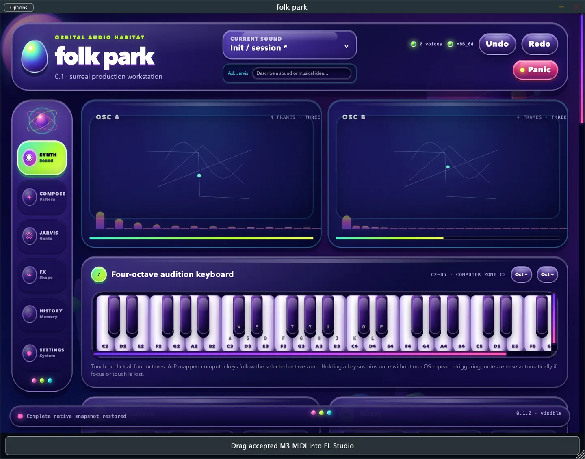
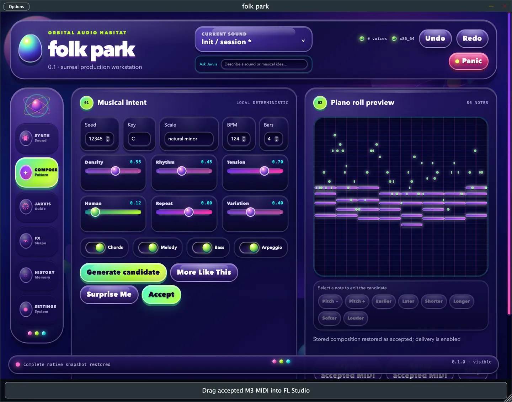
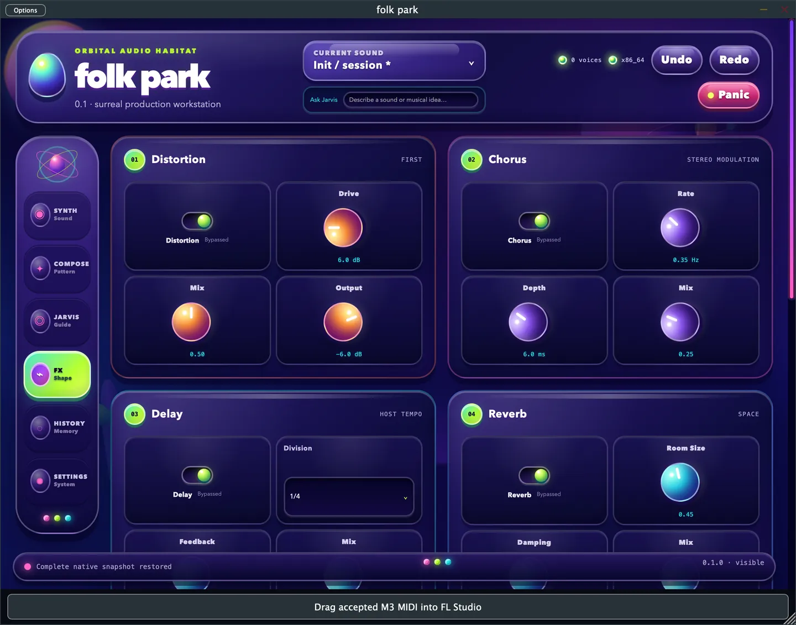

# folk park

Sintetizador wavetable original (VST3 y aplicación independiente) con un asistente de composición determinista, hecho en C++20 con JUCE. Está pensado para productores musicales que usan FL Studio en macOS Intel. Es un proyecto personal en solitario.

**Autor:** [Hermann Pauwells Rivera](https://hermannpr.github.io/), 2026.



## Estado

La versión 0.1 todavía no tiene binario público. Las pruebas automáticas del último punto de control (M8) pasan: 19 de 19 contratos de interfaz, 16 de 16 suites de pruebas en Release y la validación con pluginval 1.0.4 en nivel 5. Falta la revisión manual en FL Studio, la firma del instalador y definir la licencia de JUCE para distribución.

El trabajo verificado vive en las ramas [`feat/m8-release-hardening`](https://github.com/HermannPR/folk-park/tree/feat/m8-release-hardening) y [`feat/rhythm-lab-r1`](https://github.com/HermannPR/folk-park/tree/feat/rhythm-lab-r1). La rama principal contiene la base del proyecto, la documentación y la evidencia.

## Qué hace

- Sintetizador de 16 voces con dos osciladores wavetable, unísono, filtro, tres envolventes y cuatro LFO.
- Matriz de modulación con hasta 32 rutas.
- Generador de ideas MIDI (acordes, melodía, bajo y arpegios) a partir de semilla, tonalidad, escala y tempo. El resultado se puede editar en un piano roll y exportar como MIDI.
- Cadena fija de seis efectos con bypass individual: distorsión, chorus, delay, reverb, compresor y ecualizador.
- Render fuera de línea a WAV estéreo de 24 bits y 48 kHz.
- Presets versionados y un historial de composiciones en SQLite, con recuperación de archivos faltantes.
- Asistente local llamado Jarvis que propone cambios de parámetros. No usa red ni cuentas, y nada se aplica sin que el usuario lo acepte.
- Audio en tiempo real sin reservas de memoria ni bloqueos en el hilo de audio.

## Capturas





## Tecnologías

C++20, JUCE 8.0.13, CMake con Ninja, SQLite, y una interfaz en React, TypeScript y Vite dentro de un WebView de JUCE. Las pruebas usan CTest, pruebas de Node y pluginval.

## Cómo compilarlo

Requiere una Mac Intel con macOS 12 o superior, Xcode Command Line Tools, CMake 3.25 o superior, Ninja, Node.js y npm.

```bash
git clone --recurse-submodules https://github.com/HermannPR/folk-park.git
cd folk-park
./scripts/bootstrap_macos.sh
./scripts/build_x86_64.sh
./scripts/test.sh
```

La interfaz se construye dentro de la carpeta `ui` con `npm ci` y `npm run build`. No se necesita ninguna clave de API.

## Documentación

En la carpeta `docs` están la arquitectura, las reglas de tiempo real, el formato de presets y las decisiones de diseño. En `evidence` se guardan los resultados de cada punto de control.

## Licencias

Las dependencias de terceros y su estado de licencia están en `LICENSES.md`.
